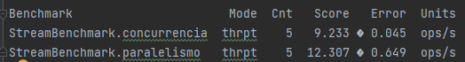

# Proyecto Integrador de la Unidad 2 de Programación II
## Benchmarks

Los resultados completos de los benchmarks se encuentran en la carpeta `resultados_benchmark`

El benchmark de concurrencia corresponde al uso de Stream, y el de paralelismo al de ParalellStream.
Para medir la performance de cada uno de los algoritmos se usa la magnitud operaciones por segundo (ops/s).
En ese sentido, ParallelStream supera a Stream, ya que presenta más operaciones por segundo,
y deberíamos usar dicha clase para nuestro programa que busca filtrar elementos de una lista.

Además, podemos resaltar también que la variabilidad de las mediciones para Stream fue menor
que la de las mediciones con ParallelStream, lo que da más confiabilidad a la primera. Sin embargo,
la diferencia entre los promedios de ambas clases sigue siendo amplia, por lo que el error no modifica
la elección en este caso.
